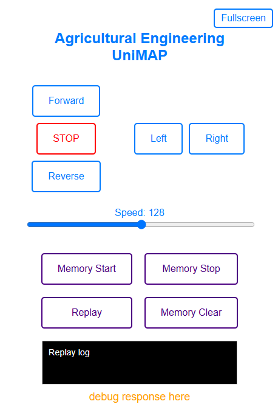

# 🚗 ESP32 RC WiFi Car Controller – UniMAP Edition

This project enables remote control of a 4-wheel car using an ESP32 microcontroller over a WiFi Access Point, designed for educational STEM programs and agricultural automation use at Universiti Malaysia Perlis (UniMAP). The ESP32 serves a sleek browser interface for real-time movement control, speed tuning, and motion recording.

## 📦 Project Structure

```
.
├── ESP32_RCWIFI.ino                         # Main Arduino sketch for ESP32 motor control logic
├── html_page.h                              # Embedded HTML/JS served by ESP32
└── README.md

or

├── ESP32_RCWIFI_UPDATED.ino                 # Arduino sketch with hardware of JSN-SRT04 for obstacle detection
├── html_page1.h                             # HTML/JS served by ESP32
└── README.md
```

## 🚀 Features

- ESP32-powered standalone WiFi Access Point (`RC_Car_AP`)
- Web-based dashboard for:
  - Movement control (Forward, Reverse, Left, Right, Stop)
  - Speed adjustment via slider (0–255)
  - Motion memory recording and replay
  - Fullscreen mobile mode
- Hold-duration controls via mouse and touch events
- Scrollable debug and movement log area

## 🛠 Hardware Requirements

- ESP32 development board (e.g., ESP32 DevKit V1)
- Dual H-bridge motor driver (e.g., BTS7960 or L298N)
- 4 DC motors and chassis platform
- Power supply (e.g., Li-ion or LiPo battery)
- Jumper wires, basic soldering or breadboard setup
- JSN-SRT04 Ultrasonic Sensor (optional)

## 🔧 Software Requirements

- Arduino IDE with ESP32 board package
- No additional libraries needed (uses native `WiFi.h` and `WebServer.h`)

## 🌐 Web UI Preview

The HTML UI served by the ESP32 features:
- Responsive layout for phone/tablet/desktop
- JavaScript-based `fetch()` API for backend communication
- Instant feedback via debug panel
- Fullscreen mode for immersive RC experience

📸





## 🧠 Memory Functionality

- **Memory Start**: Begins recording directional commands
- **Memory Stop**: Ends recording session
- **Replay**: Replays recorded motion in sequence
- **Memory Clear**: Deletes saved motion log

This allows replaying previously driven routes manually.

## 🕹️ Getting Started

1. Upload `ESP32_RCWIFI_hold_duration_analog_2.ino` via Arduino IDE
2. Connect to the ESP32’s WiFi (SSID: `RC_Car_AP`)
3. Open browser and navigate to `http://192.168.4.1`
4. Use the control buttons and sliders

## 🎓 Educational Context

This system was developed to introduce microcontroller programming, motor control, and web-based interfaces in STEM and agricultural engineering modules. Ideal for:

- School and university STEM days
- Workshops on embedded systems
- Prototyping educational robots

## 📜 License

This project is licensed under the **GNU General Public License v3.0**.  
You may redistribute and/or modify it under the terms of the GNU GPL v3.

See the [LICENSE](LICENSE) file or visit https://www.gnu.org/licenses/gpl-3.0.html for more.

## 🙏 Credits

Developed by **Zainal Abidin Arsat**  
In collaboration with the **Agricultural Engineering Department**, Universiti Malaysia Perlis (UniMAP)
