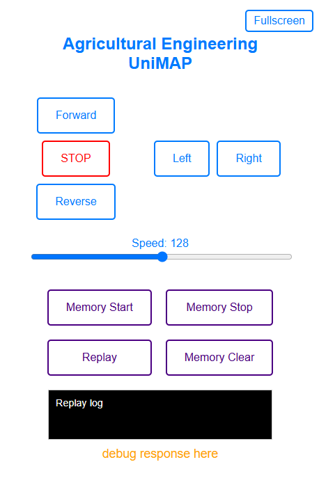

# 🚗 ESP32 RC WiFi Car Controller – UniMAP Edition

This project enables remote control of a 4-wheel car using an ESP32 microcontroller over a WiFi Access Point, designed for educational STEM programs and agricultural automation use at Universiti Malaysia Perlis (UniMAP). The ESP32 serves a sleek browser interface for real-time movement control, speed tuning, and motion recording.

## 📦 Project Structure

```
.
├── ESP32_RCWIFI.ino                         # Single Arduino sketch: motor control + arcade drive mixing + optional obstacle detection
├── html_page.h                              # Embedded HTML/JS served by ESP32 (dual-joystick landscape UI)
├── firmware/                                # Prebuilt, ready-to-flash binaries (see below)
│   ├── merged.bin
│   ├── bootloader.bin
│   ├── partitions.bin
│   ├── firmware.bin
│   └── flash.sh
├── assets/                                  # Screenshots etc.
└── README.md
```

## 🚀 Features

- ESP32-powered standalone WiFi Access Point (`rc_UNIMAP`)
- Landscape-only dual-joystick dashboard for phone/tablet control:
  - Left stick: throttle (forward/reverse)
  - Right stick: steering (left/right)
  - Both sticks blend in real time on the ESP32 into true differential-drive motor mixing (arcade-style), so you can steer while moving
  - Portrait mode shows a "rotate your phone" prompt instead of the controls
- Max speed cap via slider (40–255), scaled by joystick deflection
- Motion memory recording and smart single/loop replay (blended drive is approximated to the closest discrete direction for playback)
- Fullscreen mobile mode
- Obstacle detection during replay (JSN-SR04T ultrasonic sensor); safe to leave unwired — readings simply become "no obstacle" if the sensor isn't connected
- Hold/drag-duration controls via pointer events (mouse + touch)
- Scrollable debug and movement log area

## 🛠 Hardware Requirements

- ESP32 development board (e.g., ESP32 DevKit V1)
- Dual H-bridge motor driver (e.g., BTS7960 or L298N)
- 4 DC motors and chassis platform
- Power supply (e.g., Li-ion or LiPo battery)
- Jumper wires, basic soldering or breadboard setup
- JSN-SR04T Ultrasonic Sensor (optional, enables obstacle-pause during replay)

## 🔧 Software Requirements

- Arduino IDE with ESP32 board package, **or** PlatformIO (`platformio.org`) — both build the same sketch
- No additional libraries needed (uses native `WiFi.h` and `WebServer.h`)
- `esptool` if flashing the prebuilt binaries directly instead of building from source

## 🌐 Web UI Preview

The HTML UI served by the ESP32 features:
- Dark, professional dashboard design, forced landscape orientation (portrait shows a "rotate your phone" prompt)
- Dual on-screen joysticks: left stick controls throttle (forward/reverse), right stick controls steering (left/right) — both blend together in real time for actual steer-while-driving control
- Responsive layout tuned for phone/tablet landscape use
- JavaScript-based `fetch()` API for backend communication
- Instant feedback via debug panel
- Verified working on real ESP32 hardware ✅

📸





## 🧠 Memory Functionality

- **Memory Start**: Begins recording directional commands
- **Memory Stop**: Ends recording session
- **Replay**: Replays recorded motion in sequence
- **Memory Clear**: Deletes saved motion log

This allows replaying previously driven routes manually.

## 🕹️ Getting Started

1. Upload `ESP32_RCWIFI.ino` via Arduino IDE, **or** flash the prebuilt binaries in [`firmware/`](firmware/) directly with `esptool` (no Arduino IDE needed) — run `firmware/flash.sh /dev/ttyUSB0` (adjust the port for your OS)
2. Connect to the ESP32’s WiFi (SSID: `rc_UNIMAP`)
3. Open browser and navigate to `http://192.168.4.1`
4. Drag the on-screen joystick to drive, set max speed, and use record/replay

## 📦 Prebuilt Firmware

The [`firmware/`](firmware/) folder contains ready-to-flash binaries built from the current sketch (PlatformIO, `esp32dev` board):

- `merged.bin` — bootloader + partition table + app combined into one image, flash at `0x0`. **Use this one.**
- `bootloader.bin` @ `0x1000`, `partitions.bin` @ `0x8000`, `firmware.bin` @ `0x10000` — the same three pieces kept separately, in case a tool needs them individually.

Flash with `firmware/flash.sh [serial-port]`, or manually:

```
esptool --chip esp32 --port <PORT> --baud 460800 write_flash -z 0x0 firmware/merged.bin
```

Rebuild after editing the sketch with PlatformIO (`pio run`) or the Arduino IDE — these binaries aren't auto-regenerated.

## 🎓 Educational Context

This system was developed to introduce microcontroller programming, motor control, and web-based interfaces in STEM and agricultural engineering modules. Ideal for:

- School and university STEM days
- Workshops on embedded systems
- Prototyping educational robots

## 📜 License

This project is licensed under the **GNU General Public License v3.0**.  
You may redistribute and/or modify it under the terms of the GNU GPL v3.

See the [LICENSE](LICENSE) file or visit https://www.gnu.org/licenses/gpl-3.0.html for more.

## 🙏 Credits

Developed by **Zainal Abidin Arsat**  
In collaboration with the **Agricultural Engineering Department**, Universiti Malaysia Perlis (UniMAP)
